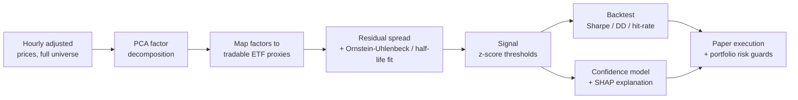

<div align="center">

# Factor Statistical Arbitrage

**Every stock in the universe, screened for mean-reversion — in one pass, not a
pairwise search.**

A single statistical pass finds the common structure across the whole market. A
tradable ETF hedge removes it. What's left either mean-reverts cleanly or it
doesn't — and every signal comes with a plain-English reason before it fires.

[](https://www.python.org/)
[](https://github.com/astral-sh/uv)
[](LICENSE)
[](#project-status)
[](#disclaimer)

</div>

---

## What it does

Most stocks drift with the market and their sector — that shared movement is noise
you can't reliably trade. This project's job is to strip that shared movement away,
automatically, for every stock in the market at once, and see what's left over.

What's left over sometimes behaves in a very useful way: it wanders off, then drifts
back — a pattern called **mean reversion**. When that pattern shows up cleanly and
reliably, it's a tradable opportunity. When it doesn't, the stock is skipped.

Three things make this more than a signal generator:

- **It checks the whole market at once**, not one hand-picked pair at a time — so it
  finds opportunities a human screening pairs one by one would simply never get to.
- **Every position is hedged with real, liquid ETFs** (like SPY or a sector fund), so
  what the system wants to trade is always something that can actually be bought and
  sold.
- **Every signal comes with a reason**, in plain English — which sector exposure was
  removed, how confident the model is, and why — not just a chart and a z-score.

It trades on paper only (no real money), against a live market-data feed, so the
whole loop — find, size, explain, execute, review — can be validated before any
capital is ever at risk.

## Why not just trade pairs?

The traditional approach — **pairs trading** — looks for two stocks whose prices
historically move together, bets that the relationship holds, and trades the gap
when they diverge. Finding good pairs by hand or by brute-force search is slow,
the good pairs are rare, and yesterday's winning pair can stop working with no
warning.

This project replaces that hand-picked search with a single statistical pass, called
**Principal Component Analysis (PCA)**, over the entire universe of stocks, so every
stock is screened the same way, all the time, and the "hedge" for each one is picked
automatically from liquid, tradable ETFs rather than another hand-picked stock.

| | Pairwise trading | This project |
|---|---|---|
| **How opportunities are found** | Manually or by brute-force search over ticker pairs | One statistical pass over the whole market |
| **What hedges the position** | Another stock, picked by hand | A liquid ETF (e.g. SPY, sector fund), picked automatically |
| **What you get out** | A pair, or nothing | Every stock, ranked, with a reason attached |
| **Why trust the signal** | "The statistical test passed" | A plain-English explanation of why, and how confident the model is |

---

## The technical version

*Skip this section unless you want the mechanics.*

Factor Statistical Arbitrage decomposes the whole universe's return covariance with
PCA in a single pass, then asks one question of *every* stock at once:

> After removing the common market/sector structure, does what's left mean-revert
> quickly and cleanly?

Each stock is regressed onto a small set of **tradable ETF proxies** (e.g. sector ETF +
SPY), so the residual spread is directly executable — no synthetic factor portfolios.
The regression weights double as a plain-English explanation:

> "JPM trades like 1.23x XLF, roughly SPY-neutral, R² = 0.72, half-life 4.2h."

A confidence model and **SHAP (SHapley Additive exPlanations)** layer then score and
explain each candidate before any capital is committed — so every trade has a reason
attached, not just a z-score.

## How it works



| Stage | What happens |
|---|---|
| **Decompose** | PCA on standardized hourly returns across the universe; keep the top-k components (~50–70% of variance). |
| **Map to proxies** | Regress each stock on liquid ETFs so exposures are tradable *and* interpretable. |
| **Residual & Ornstein-Uhlenbeck (OU) fit** | Log-spread of stock vs. weighted proxies; fit an Ornstein-Uhlenbeck process for half-life and fit quality. |
| **Signal** | Enter/exit on residual z-score thresholds. |
| **Backtest** | Look-ahead-safe fills; Sharpe, drawdown, hit-rate gates. |
| **Explain** | LightGBM confidence classifier + SHAP over discovery-stage features. |
| **Execute** | Paper trading via Alpaca, behind correlation and drawdown risk guards. |

## Tech stack

- **Python 3.11**, managed end-to-end with [**uv**](https://github.com/astral-sh/uv)
- **Data / modeling** — pandas, NumPy, scikit-learn, statsmodels, LightGBM, SHAP
- **Storage** — PostgreSQL (SQLAlchemy), ~2.5 years of hourly adjusted bars for 1,000+ symbols
- **Orchestration** — Prefect (scheduled discovery & data refresh)
- **Execution** — Alpaca (paper)
- **Dashboard** — Streamlit

## Getting started

> Requires [uv](https://github.com/astral-sh/uv) and a local PostgreSQL instance.

```bash
# 1. Install the environment (uv provisions Python 3.11 itself)
uv sync
uv run scripts/check_env.py          # verify the install

# 2. Configure
cp .env.example .env                 # then set POSTGRES_PASSWORD and Alpaca paper keys

# 3. Provision the databases + schema
uv run scripts/provision_db.py       # create factor_stat_arb + prefect DBs and schemas
uv run scripts/test_migrations.py    # (optional) verify a clean migration replay

# 4. Seed market/reference data
uv run scripts/seed_data.py          # symbols, market_data, technical_indicators
```

## Repository layout

```
src/
  config/                     app + database settings (pydantic-settings)
  shared/                     market data access, DB models, Prefect flows
  services/
    strategy_engine/
      factor_stat_arb/        PCA · proxy mapping · OU residual · explainability   (planned)
      baskets/ pairs/         reused spread + signal + sizing primitives
      backtesting/            look-ahead-safe backtest engine
    risk_management/          portfolio risk guards
    alpaca/                   paper-trading client
scripts/                      env check, DB provisioning, schema clone, seeding, discovery
streamlit_ui/                 dashboard pages
docs/PROJECT_SPEC.md          detailed design + build plan
```

## Project status

Early-stage. The **infrastructure and data foundation are in place**; the factor
discovery and explainability layers are the active build.

- [x] Reproducible environment (uv, pinned Python, locked deps)
- [x] PostgreSQL provisioned, schema built, ~8.7M market-data rows seeded
- [x] Reused data / backtest / risk / execution primitives wired and import-tested
- [x] PCA factor model + tradable-proxy mapping
- [x] OU residual fit + discovery script
- [ ] Factor backtest engine
- [ ] Prefect discovery flow
- [ ] Confidence model + SHAP explainability
- [ ] Streamlit Factor Lab

See [`docs/PROJECT_SPEC.md`](docs/PROJECT_SPEC.md) for the full design and milestone plan.

See [CONTRIBUTING.md](CONTRIBUTING.md) for the development workflow and
[SECURITY.md](SECURITY.md) for the security policy.

## Disclaimer

This is a **technical and educational project**, not investment advice. It runs against
Alpaca's **paper** endpoint only and has not been validated over a meaningful
out-of-sample period. Nothing here is a recommendation to trade any security.

## License

[MIT](LICENSE)
