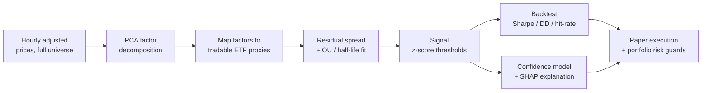

<div align="center">

# Factor Statistical Arbitrage

**Explainable factor-residual statistical arbitrage on US equities.**

Extract statistical factors from the whole universe, trade what mean-reverts in the
residual, and explain every signal before it fires.

[](https://www.python.org/)
[](https://github.com/astral-sh/uv)
[](LICENSE)
[](#project-status)
[](#disclaimer)

</div>

---

## The idea

Classic pairs and basket strategies hunt for a *pair* or *tuple* of tickers that happen
to cointegrate — a combinatorial search over discrete ticker sets, filtered by a strict
statistical test. On real data that search tends to come back sparse and unstable.

**Factor Stat Arb sidesteps the combinatorics.** It decomposes the entire universe's
return covariance with PCA in a single pass, then asks one question of *every* stock:

> After removing the common market/sector structure, does what's left mean-revert
> quickly and cleanly?

Each stock is regressed onto a small set of **tradable ETF proxies** (e.g. sector ETF +
SPY), so the residual spread is directly executable — and the loadings double as a
plain-English explanation ("this name trades like 70% XLF, 20% SPY"). A confidence model
and SHAP layer then score and explain each candidate signal before any capital is
committed.

## How it works



| Stage | What happens |
|---|---|
| **Decompose** | PCA on standardized hourly returns across the universe; keep the top-k components (~50–70% of variance). |
| **Map to proxies** | Regress each stock on liquid ETFs so exposures are tradable *and* interpretable. |
| **Residual & OU** | Log-spread of stock vs. weighted proxies; fit an Ornstein–Uhlenbeck process for half-life and fit quality. |
| **Signal** | Enter/exit on residual z-score thresholds. |
| **Backtest** | Look-ahead-safe fills; Sharpe, drawdown, hit-rate gates. |
| **Explain** | LightGBM confidence classifier + SHAP over discovery-stage features. |
| **Execute** | Paper trading via Alpaca, behind correlation and drawdown risk guards. |

## Tech stack

- **Python 3.11**, managed end-to-end with [**uv**](https://github.com/astral-sh/uv)
- **Data / modeling** — pandas, NumPy, scikit-learn, statsmodels, LightGBM, SHAP
- **Storage** — PostgreSQL (SQLAlchemy), ~2.5 years of hourly adjusted bars for 1,000+ symbols
- **Orchestration** — Prefect (scheduled discovery & data refresh)
- **Execution** — Alpaca (paper)
- **Dashboard** — Streamlit

## Getting started

> Requires [uv](https://github.com/astral-sh/uv) and a local PostgreSQL instance.

```bash
# 1. Install the environment (uv provisions Python 3.11 itself)
uv sync
uv run scripts/check_env.py          # verify the install

# 2. Configure
cp .env.example .env                 # then set POSTGRES_PASSWORD and Alpaca paper keys

# 3. Provision the databases + schema
uv run scripts/provision_db.py       # create factor_stat_arb + prefect DBs and schemas
uv run scripts/test_migrations.py    # (optional) verify a clean migration replay

# 4. Seed market/reference data
uv run scripts/seed_data.py          # symbols, market_data, technical_indicators
```

## Repository layout

```
src/
  config/                     app + database settings (pydantic-settings)
  shared/                     market data access, DB models, Prefect flows
  services/
    strategy_engine/
      factor_stat_arb/        PCA · proxy mapping · OU residual · explainability   (planned)
      baskets/ pairs/         reused spread + signal + sizing primitives
      backtesting/            look-ahead-safe backtest engine
    risk_management/          portfolio risk guards
    alpaca/                   paper-trading client
scripts/                      env check, DB provisioning, schema clone, seeding, discovery
streamlit_ui/                 dashboard pages
docs/PROJECT_SPEC.md          detailed design + build plan
```

## Project status

Early-stage. The **infrastructure and data foundation are in place**; the factor
discovery and explainability layers are the active build.

- [x] Reproducible environment (uv, pinned Python, locked deps)
- [x] PostgreSQL provisioned, schema built, ~8.7M market-data rows seeded
- [x] Reused data / backtest / risk / execution primitives wired and import-tested
- [ ] PCA factor model + tradable-proxy mapping
- [ ] OU residual fit + discovery script
- [ ] Factor backtest engine
- [ ] Prefect discovery flow
- [ ] Confidence model + SHAP explainability
- [ ] Streamlit Factor Lab

See [`docs/PROJECT_SPEC.md`](docs/PROJECT_SPEC.md) for the full design and milestone plan.

## Disclaimer

This is a **technical and educational project**, not investment advice. It runs against
Alpaca's **paper** endpoint only and has not been validated over a meaningful
out-of-sample period. Nothing here is a recommendation to trade any security.

## License

[MIT](LICENSE)
