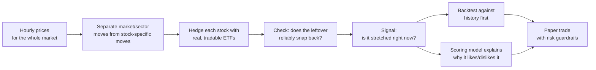



---

## The idea

Most stocks move for two reasons: the market/sector they belong to has a good
or bad day, and something specific to that company happens. If you strip away
the first part -- the market and sector noise -- what's left is the stock's
own story. Sometimes that leftover wobbles around a stable average and then
snaps back, the way a stretched rubber band does. That snap-back is what this
project is built to find and (on paper) trade.

The traditional way to look for this kind of opportunity is "pairs trading":
hunt through thousands of possible ticker pairs (e.g. Coke vs. Pepsi) for two
that historically move together, and bet on the rare moments they drift
apart. That search is slow, and pairs that worked in the past often stop
working later.

**This project skips the pair-hunting.** Instead, it looks at the entire
market at once, statistically separates "what moved because of the market/
sector" from "what's left over for each stock individually," and asks the
same question for every single stock: *is the leftover part currently
stretched away from its normal range, and does it reliably snap back?*

Each stock's market/sector exposure is measured against a small handful of
real, tradable ETFs (an S&P 500 fund plus that stock's sector fund, e.g.
energy or financials) -- not an abstract statistical construct. That has two
payoffs: the hedge is something you could actually buy or sell, and the
result reads in plain English, e.g. "Exxon currently trades like 85% its
energy sector ETF plus 15% the S&P 500." Before any paper trade is placed, a
separate scoring model reviews the setup and produces a plain explanation of
why it does or doesn't like the trade -- so every signal comes with its
reasoning attached, not just a number.

## At a glance

| | |
|---|---|
| **Data** | ~2.5 years of hourly price history for 1,000+ US stocks, stored in PostgreSQL |
| **Discovery** | Separate market/sector effects from stock-specific moves, hedge with real ETFs, keep only the setups that reliably snap back, rank them |
| **Execution** | Alpaca **paper trading** only -- no real money, ever -- with guardrails on how much any one position or the whole book can lose |
| **Tooling** | [uv](https://github.com/astral-sh/uv)-managed; `uv run main.py up` starts everything (scheduler, dashboard, worker) |

## Project status

The data pipeline and the "find and screen candidates" stage are working end
to end. The next big pieces -- backtesting candidates against history and the
plain-English scoring model -- are the active build.

- [x] Reproducible environment (uv, pinned Python 3.11, locked deps)
- [x] PostgreSQL provisioned, schema built, ~8.7M market-data rows seeded
- [x] Market/sector decomposition + tradable-ETF hedge mapping
- [x] Mean-reversion fit + discovery script (finds and ranks candidates)
- [ ] Backtest engine (test candidates against history before trusting them)
- [ ] Scheduled discovery flow (find new candidates automatically)
- [ ] Scoring model + plain-English explanations for each signal
- [ ] Streamlit "Factor Lab" dashboard

See the [Project Spec]({{ "/project-spec/" | relative_url }}) for the full design and milestone plan.

## How a trade idea gets found

---

**Disclaimer:** This is a technical and educational project, not investment advice.
It runs against Alpaca's paper endpoint only and has not been validated over a meaningful
out-of-sample period.
{: .notice--warning}
