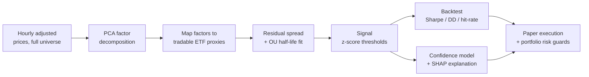



---

## The idea

Classic pairs and basket strategies hunt for a *pair* or *tuple* of tickers that happen
to cointegrate -- a combinatorial search over discrete ticker sets, filtered by a strict
statistical test. On real data that search tends to come back sparse and unstable.

**Factor Stat Arb sidesteps the combinatorics.** It decomposes the entire universe's
return covariance with PCA in a single pass, then asks one question of *every* stock:

> After removing the common market/sector structure, does what's left mean-revert
> quickly and cleanly?

Each stock is regressed onto a small set of **tradable ETF proxies** (e.g. sector ETF +
SPY), so the residual spread is directly executable -- and the loadings double as a
plain-English explanation ("this name trades like 70% XLF, 20% SPY"). A confidence model
and SHAP layer then score and explain each candidate signal before any capital is
committed.

## At a glance

| | |
|---|---|
| **Data** | PostgreSQL, ~2.5 years of hourly adjusted bars for 1,000+ symbols |
| **Discovery** | PCA &rarr; tradable ETF proxy regression &rarr; OU residual screen &rarr; ranked candidates |
| **Execution** | Alpaca **paper** only, behind portfolio risk guards |
| **Tooling** | [uv](https://github.com/astral-sh/uv)-managed; `uv run main.py up` starts Prefect + dashboard + worker |

## Project status

The data foundation, factor discovery pipeline (PCA, proxy mapping, OU screen), and
services are in place. The backtest engine and explainability layer are the active build.

- [x] Reproducible environment (uv, pinned Python 3.11, locked deps)
- [x] PostgreSQL provisioned, schema built, ~8.7M market-data rows seeded
- [x] PCA factor model + tradable-proxy mapping
- [x] OU residual fit + discovery script
- [ ] Factor backtest engine
- [ ] Prefect discovery flow
- [ ] Confidence model + SHAP explainability
- [ ] Streamlit Factor Lab

See the [Project Spec](/factor-stat-arb/project-spec/) for the full design and milestone plan.

## Pipeline

---

**Disclaimer:** This is a technical and educational project, not investment advice.
It runs against Alpaca's paper endpoint only and has not been validated over a meaningful
out-of-sample period.
{: .notice--warning}
