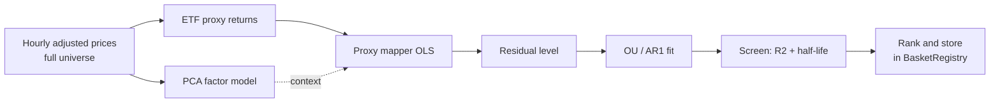

# Methodology

How Factor Stat Arb finds and screens tradable residuals, stage by stage.

## Pipeline overview



## 1. Data

Hourly split/dividend-adjusted closes are pulled into a wide `time x symbol`
matrix and converted to log returns. The cleaning step drops sparse symbols
(too many missing bars) and absurd ticks so downstream steps receive a dense,
reliable matrix.

The stock universe (~1,000 names) is kept separate from the ETF proxies used
for hedging, so ETFs never enter the PCA and distort the factor structure.

## 2. Factor model

`FactorModel` standardizes each symbol's returns and fits PCA across the
cross-section, keeping the smallest number of components that explain a target
share of variance (default ~60%). It exposes factor **loadings**, **factor
returns**, the common-factor **reconstruction**, and the **residuals** left
after removing common structure.

On the live universe, ~22 components explain 60% of variance. PC1 -- the
broad market factor -- accounts for roughly 20% on its own.

The factor model answers "what is the common structure?" The actual hedge
comes from the proxy mapper, because PCA factors are statistical constructs
and not directly tradable instruments.

## 3. Proxy mapper

Each stock's returns are regressed (OLS) on a small set of **liquid, tradable
ETFs** -- SPY plus the stock's SPDR sector ETF (e.g. XLF for financials,
XLE for energy). The fitted betas become the hedge weights:

> "JPM trades like 1.23 XLF, roughly SPY-neutral, R2 = 0.72."

Because regressing returns is equivalent to regressing log-price changes, the
betas are exactly the weights of a log-price spread basket:
`+1` on the stock, `-beta` on each proxy.

This step is what makes the strategy both **directly executable** (weights map
to real tradable instruments) and **interpretable** (each basket has a
sector/market loading that a human can read).

### Two residual objects

| Object | Definition | Use |
|---|---|---|
| **Traded spread** | `log P_stock - sum(beta * log P_proxy)` | What gets executed; z-scored against a rolling window |
| **Residual level** | Cumulative idiosyncratic returns (Avellaneda-Lee) | OU half-life is estimated here -- drift-free, so the estimate is unbiased |

The distinction matters: the traded spread carries the regression alpha as a
linear drift, which would inflate the OU half-life estimate.
`residual_level()` removes that drift before fitting.

## 4. OU fit and screening

The residual level is fit as an AR(1) process `s_t = a + b*s_{t-1} + eps`
-- the discrete Ornstein-Uhlenbeck model. From the fitted coefficient `b`:

- Mean-reversion speed: `theta = -ln(b)`
- **Half-life**: `ln(2) / theta` (bars = hours)
- Long-run mean and equilibrium standard deviation

A candidate passes the screen if `0 < b < 1` (genuinely mean-reverting) and
its half-life falls inside the configured bounds.

### Half-life calibration

Factor residuals mean-revert considerably more slowly than cointegrated pairs.
Measured across the live universe on drift-free residuals:

| p25 | Median | p75 |
|---|---|---|
| 166h | **263h (~38 trading days)** | 393h |

The default screen is **48--400h**:

- Below 48h: likely microstructure noise, not a structural factor residual.
- Above 400h: effectively a random walk over any practical holding period.

## 5. Discovery and ranking

The discovery script runs the full chain over the universe:

1. Proxy-regress each stock; keep those with `proxy_r2 >= 0.30`.
2. Build the residual level, fit OU, keep half-lives in `48--400h`.
3. Rank survivors by `proxy_r2 * z_score_abs_mean` (fit quality x tradability).
4. Store the top-N in `strategy_engine.basket_registry` with
   `is_active=False` pending manual review.

```bash
uv run scripts/discover_factor_baskets.py --dry-run      # preview, no writes
uv run scripts/discover_factor_baskets.py --top-n 50     # discover + store
```

A recent run produced 50 candidates; Energy and Financials dominate because
tight sector-ETF tracking yields the cleanest residuals. Example:
`FSA_XOM` = XOM hedged with SPY + XLE, half-life 192h, proxy R2 0.83.

### What gets stored

| Column | Factor meaning |
|---|---|
| `hedge_weights` | `+1` stock, `-beta` each proxy (log-price spread weights) |
| `half_life_hours` | OU half-life of the drift-free residual |
| `min_correlation` | Proxy regression R2 (fit strength) |
| `coint_pvalue` | `1 - proxy_r2` (fit-quality analog to a p-value) |
| `rank_score` | `proxy_r2 * z_score_abs_mean` |

## What comes next

The backtest engine (`FactorBacktestEngine`) validates each candidate before
activation -- Sharpe ratio, max drawdown, and hit rate gates. The
explainability layer (LightGBM confidence model + SHAP) then scores and
explains each live signal candidate.

See the [Architecture]({{ "/project-spec/" | relative_url }}) page for the
full system design and milestone plan.
