# Methodology

How Factor Stat Arb finds and screens tradable residuals. Each stage maps to a
module under `src/services/strategy_engine/factor_stat_arb/`.

## Pipeline

```mermaid
flowchart LR
    A[Hourly adjusted prices] --> B[PCA factor model]
    A --> C[ETF proxy returns]
    C --> D[Proxy mapper: OLS]
    B -. context .-> D
    D --> E[Residual level]
    E --> F[OU / AR&#40;1&#41; fit]
    F --> G[Screen: R2 + half-life]
    G --> H[Rank & upsert to BasketRegistry]
```



## 1. Data (`data.py`)

Hourly split/dividend-adjusted closes (`data_source='yahoo_adjusted'`) are pulled
in one query into a wide `time x symbol` matrix, converted to log returns, and
cleaned: sparse symbols and absurd ticks are dropped so downstream steps get a
dense matrix. The stock universe (~1,000 names) comes from
`data_ingestion.symbols`; ETF proxies are kept separate so they never leak into
the stock-only PCA.

## 2. Factor model (`factor_model.py`)

`FactorModel` standardizes each symbol's returns and fits PCA across the
cross-section, keeping the smallest number of components that explain a target
share of variance (default ~60%). It exposes factor **loadings**, **factor
returns**, the common-factor **reconstruction**, and the **residuals** left after
removing common structure. On the real universe, ~22 components explain 60% of
variance (PC1, the market factor, ~20%).

The factor model gives the "what is the common structure" view; the tradable
hedge, however, comes from the proxy mapper, because PCA factors are not directly
tradable.

## 3. Proxy mapper (`proxy_mapper.py`)

Each stock's returns are regressed (OLS) on a small set of **tradable** ETFs -
`SPY` plus the stock's SPDR sector ETF (e.g. `XLF` for financials). The fitted
betas are hedge weights that make the residual spread both executable and
interpretable:

> "JPM trades like 1.23 XLF, roughly SPY-neutral, R2 = 0.72."

Because regressing returns is equivalent to regressing log-price changes, the
betas are exactly the weights of a log-price spread basket:
`+1` on the stock, `-beta` on each proxy.

### Two residual objects

| Object | Definition | Use |
|---|---|---|
| **Traded spread** | `log P_stock - sum(beta * log P_proxy)` | What's executed; z-scored with a rolling window that absorbs the alpha drift |
| **Residual level** | cumulative idiosyncratic returns (Avellaneda-Lee) | What the **OU half-life is fit on** - drift-free, so the half-life is meaningful |

The distinction matters: the traded spread carries the regression alpha as a
linear drift, which would inflate the OU half-life. `residual_level()` subtracts
it.

## 4. Residual OU fit (`residual_ou.py`)

The residual level is fit as an AR(1) process `s_t = a + b*s_{t-1} + eps` (the
discretized Ornstein-Uhlenbeck). From `b`:

- mean-reversion speed `theta = -ln(b)`
- **half-life** `= ln(2) / theta` (bars = hours)
- long-run mean, equilibrium std

A candidate must be mean-reverting (`0 < b < 1`) with a half-life inside the
screening bounds.

### Half-life calibration

Factor residuals mean-revert far more slowly than cointegrated pairs. Measured
across the universe (drift-free residual, `scripts/analyze_residual_halflife.py`):

| p25 | median | p75 |
|---|---|---|
| 166h | **263h (~38 trading days)** | 393h |

The pairs bounds (5-72h) pass only ~1% of names. The factor-appropriate default
is **48-400h** (`DEFAULT_MIN/MAX_HALF_LIFE`), dropping ultra-fast reverters
(microstructure) and near-random-walk names.

## 5. Discovery (`scripts/discover_factor_baskets.py`)

Runs the whole chain over the universe:

1. proxy-regress each stock, keep those with `proxy_r2 >= 0.30`;
2. build the residual level, fit OU, keep half-lives in `48-400h`;
3. rank survivors by `proxy_r2 * z_score_abs_mean` (fit quality x tradability);
4. upsert the top-N into `strategy_engine.basket_registry` with
   `is_active=False` (pending manual review, same convention as pairs/baskets).

```bash
uv run scripts/discover_factor_baskets.py --dry-run      # preview, no writes
uv run scripts/discover_factor_baskets.py --top-n 50     # discover + upsert
```

A recent run produced 50 candidates; Energy and Financials dominate (tight
sector-ETF tracking gives the cleanest residuals). Example: `FSA_XOM` = XOM
hedged with SPY + XLE, half-life 192h, proxy R2 0.83.

### Registry column mapping

The registry is shared with the Johansen basket strategy, so a few columns are
repurposed for the factor case:

| Column | Factor meaning |
|---|---|
| `hedge_weights` | `+1` stock, `-beta` proxies (log-price spread basket) |
| `coint_pvalue` | `1 - proxy_r2` (OLS fit-quality analog) |
| `min_correlation` | `proxy_r2` (regression fit strength) |
| `half_life_hours` | OU half-life of the residual level |
| `rank_score` | `proxy_r2 * z_score_abs_mean` |

## What's next

The backtest engine (`FactorBacktestEngine`) validates candidates before any are
activated; the explainability layer (confidence model + SHAP) scores each signal.
See the [project spec](PROJECT_SPEC.md) for the full build plan.
