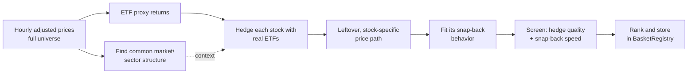

# Methodology

How this project finds stocks that look "stretched" relative to their market
and sector, and decides which of those are actually worth watching. Explained
stage by stage, in plain language first.

## The short version

Take a stock's price history. Subtract out the part that's just the stock
following the overall market and its sector up or down. What's left is the
part that's specific to that company -- and sometimes that leftover behaves
like a rubber band: it stretches away from its normal range and then snaps
back. This pipeline finds stocks where that rubber-band behavior is strong,
clean, and fast enough to be worth trading, and hedges each one with real
ETFs so the "subtract the market" step is something you can actually execute,
not just a spreadsheet exercise.

## Pipeline overview



## 1. Data

Hourly split/dividend-adjusted closing prices for roughly 1,000 stocks are
pulled into one big table (time down the side, ticker across the top) and
converted into returns (percent price change bar to bar). Symbols with too
many missing bars, or price ticks that are obviously bad data, are dropped so
later steps work off clean, complete numbers.

The stocks being analyzed are kept separate from the ETFs used later as
hedges, so the ETFs don't quietly influence the "what's common to the whole
market" calculation.

## 2. Finding the common market/sector structure

This step (technically **PCA**, principal component analysis) looks across
all ~1,000 stocks at once and asks: what handful of underlying "themes" -- a
broad market move, an energy-sector move, a rates-sensitive move, and so on
-- explain most of the day-to-day co-movement? It keeps just enough of these
themes to explain a target share (about 60%) of all the shared movement
across stocks.

On the current universe, it takes about 22 of these themes to reach 60%, and
the single biggest one -- the broad market itself -- explains roughly 20% on
its own.

This step only answers "what's the common story here?" It doesn't by itself
tell you how to hedge a specific stock -- that's the next step, because these
statistical "themes" aren't things you can directly buy or sell.

## 3. Hedging each stock with real, tradable ETFs

For each stock, its returns are compared (via linear regression) against a
small set of **liquid, real ETFs** -- an S&P 500 fund (SPY) plus that stock's
sector ETF (e.g. XLF for financials, XLE for energy). This produces a
plain-English readout like:

> "JPM trades like 1.23x XLF, with little independent S&P 500 exposure;
> this relationship explains about 72% of JPM's moves."

Because this is done on log prices, the same numbers double as portfolio
weights: buy 1 share-equivalent of the stock, short 1.23 units of XLF, and
you've built a basket whose value only reflects what's specific to JPM.

This is the step that makes the whole approach **actually tradable** (the
hedge is made of real ETFs you can buy or sell) and **understandable** (every
stock gets a plain sector/market label a non-specialist can read).

### Two versions of "the leftover"

There are actually two related numbers, used for different purposes:

| Object | What it is | Used for |
|---|---|---|
| **Traded spread** | The basket you'd actually hold (stock minus its ETF hedge, in price terms) | This is what gets traded, tracked against its own recent average |
| **Residual level** | The running total of the stock's day-by-day "leftover" moves, with any steady drift removed | Used to measure snap-back speed accurately -- drift would otherwise make the estimate misleading |

The distinction matters because the tradeable basket can carry a small steady
upward or downward drift from the hedge-fitting step, and that drift would
distort the snap-back measurement if left in. So the snap-back speed is
measured on the drift-free version instead.

## 4. Measuring the snap-back and screening candidates

The leftover price path is fit to a simple statistical model of "how strongly
does this pull back toward its average, and how fast" (technically: an
Ornstein-Uhlenbeck / AR(1) mean-reversion model). That fit produces:

- A **pull strength**: how hard it's pulled back on average
- A **half-life**: on average, how many hours it takes to close half the gap
  back to normal -- the single most intuitive number here
- Its long-run average level and typical amount of wobble around that average

A stock only qualifies as a candidate if the model shows genuine pull-back
behavior (not just drifting randomly) and its half-life falls inside a
sensible window.

### Picking that window

Measured across the live universe: half-lives cluster around 166 to 393
hours, with a **median of about 263 hours (~38 trading days)**. That's much
slower than classic pairs trading, which is expected -- this leftover is a
subtler signal than "two nearly identical stocks temporarily diverge."

The screen keeps candidates between **48 and 400 hours**:

- Faster than 48h is probably just noise, not a real repeating pattern.
- Slower than 400h is so close to a random walk that it's not worth waiting for
  in practice.

## 5. Discovery and ranking

The discovery script runs the whole pipeline over every stock in the universe:

1. Fit each stock's ETF hedge; keep only those where the hedge explains at
   least 30% of the stock's moves (a decent fit, not noise).
2. Measure the snap-back speed on the drift-free leftover; keep only
   half-lives between 48 and 400 hours.
3. Rank the survivors by combining hedge quality with how tradable the signal
   looks in practice.
4. Save the best candidates to the basket registry, flagged as inactive until
   a human reviews them.

```bash
uv run scripts/discover_factor_baskets.py --dry-run      # preview, no writes
uv run scripts/discover_factor_baskets.py --top-n 50     # discover + store
```

A recent run produced 50 candidates; Energy and Financials stocks dominate the
list, because those sectors have ETFs that track their member stocks
unusually well, which makes for a cleaner leftover signal. Example: Exxon
(XOM), hedged with SPY + the energy ETF XLE, has a half-life around 192 hours
and the hedge explains 83% of its moves.

### What gets stored for each candidate

| Column | What it means in plain terms |
|---|---|
| `hedge_weights` | How much of the stock to hold vs. how much of each ETF to short |
| `half_life_hours` | How many hours, on average, to close half the gap back to normal |
| `min_correlation` | How well the ETF hedge explains the stock's moves |
| `coint_pvalue` | A fit-quality score in the same spirit as the correlation above |
| `rank_score` | Overall ranking, combining hedge quality and how tradable the signal looks |

## What comes next

Before any candidate is traded even on paper, it still needs to prove itself
against history: the backtest engine checks things like profit-per-risk-taken
(Sharpe ratio), the worst losing streak it would have hit (max drawdown), and
how often it would have actually been right. After that, a scoring model
grades each live candidate's confidence and explains, in plain terms, which
factors drove that grade.

See the [Architecture]({{ "/project-spec/" | relative_url }}) page for the
full system design and milestone plan.
